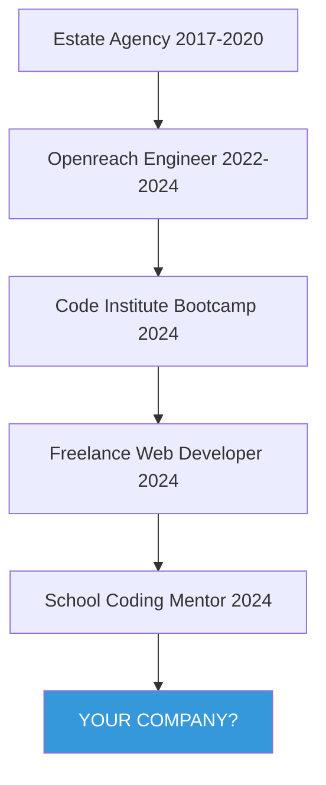

# <div align="center">👨‍💻 James Curtis | Software Developer</div>

<div align="center">
  
[](https://git.io/typing-svg)

[](https://www.linkedin.com/in/your-username)
[](https://your-portfolio-website.com)
[](mailto:jameswcurtis94@outlook.com)

</div>

##  About Me

I'm a resourceful developer who transitioned from estate agency and telecommunications engineering to software development. After completing Code Institute's intensive bootcamp, I've dedicated myself to crafting elegant solutions with Django and modern web technologies.

```javascript
const james = {
    location: "Somerset, UK",
    pronouns: "he/him",
    code: ["Python", "JavaScript", "HTML", "CSS", "SQL"],
    technologies: {
        frontEnd: {
            js: ["vanilla ES6+", "React basics"],
            css: ["Bootstrap", "Tailwind", "SCSS"]
        },
        backEnd: {
            python: ["Django", "Django REST Framework", "Flask"],
            testing: ["PyTest", "Jest basics"]
        },
        databases: ["PostgreSQL", "SQLite", "MongoDB basics"],
        deployment: ["Heroku", "Netlify", "AWS basics"],
        tools: ["Git", "GitHub", "VS Code", "Postman", "Docker"],
        learning: ["C#", "Node.js", "Advanced React"]
    },
    currentFocus: "Securing an entry-level developer role to accelerate my growth",
    funFact: "I mentor students with learning differences, teaching them to code!"
};
```

<div align="center">
  
</div>

## 🚀 Featured Projects

<table>
  <tr>
    <td width="33%" valign="top">
      <h3 align="center">Mindwell</h3>
      <br />
      <a target="_blank" href="https://github.com/your-username/mindwell">
        
      </a>
      <br />
      <p align="center">
        <a href="https://github.com/your-username/mindwell" target="_blank">
          
        </a>  
        <a href="https://mindwell-demo.herokuapp.com" target="_blank">
          
        </a>
      </p>
      <p><strong>Django, PostgreSQL, JavaScript, Bootstrap</strong> - A mental wellness platform with mood tracking, guided meditation, and resource library</p>
    </td>
    <td width="33%" valign="top">
      <h3 align="center">Wheel 2 Wheel Racing</h3>
      <br />
      <a target="_blank" href="https://github.com/your-username/wheel2wheel">
        
      </a>
      <br />
      <p align="center">
        <a href="https://github.com/your-username/wheel2wheel" target="_blank">
          
        </a>
        <a href="https://wheel2wheel-racing.netlify.app" target="_blank">
          
        </a>
      </p>
      <p><strong>Django REST, JavaScript, PostgreSQL</strong> - F1 sim racing league platform with live standings, race data, and driver profiles</p>
    </td>
    <td width="33%" valign="top">
      <h3 align="center">Windows Optimizer</h3>
      <br />
      <a target="_blank" href="https://github.com/your-username/win-optimizer">
        
      </a>
      <br />
      <p align="center">
        <a href="https://github.com/your-username/win-optimizer" target="_blank">
          
        </a>
        <a href="https://github.com/your-username/win-optimizer/releases/latest" target="_blank">
          
        </a>
      </p>
      <p><strong>Python, Tkinter, SQLite</strong> - Desktop utility for enhancing Windows performance with system monitoring and cleanup tools</p>
    </td>
  </tr>
</table>

## 💻 My Tech Stack

<div align="center">  
  
  
  
  
  
  
  
  


</div>

## 🌱 What I'm Learning Now

<div align="center">

| Technology | Progress |
| ---------- | -------- |
| C++        |  |
| C#         |  |
| AWS        |  |
| Node.js    |  |

</div>

## 💼 Career Journey



## 📫 Let's Connect!

<div align="center">
  <p>I'm actively seeking entry-level software development opportunities where I can apply my technical skills and continue to grow. Whether you have a position available, want to collaborate on a project, or just chat about tech, I'd love to hear from you!</p>
  <a href="mailto:jameswcurtis94@outlook.com">
    
  </a>
  <a href="https://www.linkedin.com/in/your-username/">
    
  </a>
