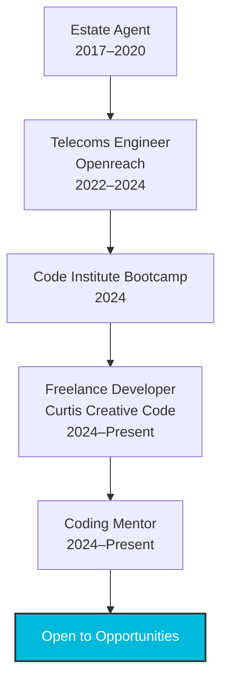

# 👨‍💻 James Curtis | Full-Stack Developer

<div align="center">
  <a href="https://git.io/typing-svg">
    
  </a>

  <a href="https://www.linkedin.com/in/jamescurtis94">
    
  </a>
  <a href="https://github.com/JWCurtis94">
    
  </a>
  <a href="https://curtiscreativecode.co.uk">
    
  </a>
  <a href="mailto:jameswcurtis94@outlook.com">
    
  </a>
</div>

---

## 🧠 About Me

I'm James Curtis, a full-stack developer based in Bristol, UK, with a passion for crafting intuitive, scalable, and impactful digital solutions. After a successful career in estate agency and telecommunications, I transitioned into software development through Code Institute’s intensive bootcamp (2024). Now, I specialize in building robust back-end APIs with Django and creating responsive, user-friendly front-ends with modern web technologies.

As the founder of [Curtis Creative Code](https://curtiscreativecode.co.uk), I deliver freelance projects and mentor aspiring developers, particularly those with learning differences. My approach combines technical expertise, creative problem-solving, and a commitment to continuous learning.

```javascript
const james = {
  location: "Bristol, UK",
  pronouns: "he/him",
  languages: ["Python", "JavaScript", "HTML", "CSS", "SQL"],
  stack: {
    frontend: ["React", "Tailwind CSS", "Bootstrap"],
    backend: ["Django", "Django REST Framework", "Flask", "Node.js (learning)"],
    databases: ["PostgreSQL", "SQLite", "MongoDB (fundamentals)"],
    tools: ["Git", "Docker", "Postman", "Heroku", "Netlify", "VS Code"],
  },
  learning: ["C#", "React Native", "AWS", "System Design"],
  funFact: "I mentor aspiring coders and am building tools to optimize privacy and performance!",
};
```

---

## 🛠️ Skills & Technologies

<div align="center">
  
</div>

---

## 🚀 Featured Projects

Here are some of my standout projects that showcase my skills and passion for development:

- **[InebriAid](https://github.com/JWCurtis94/InebriAid)**  
  A Django-based application designed to support responsible drinking with real-time tracking and personalized insights.  
  *Technologies*: Django, PostgreSQL, Tailwind CSS, JavaScript  
  [View Live Demo](https://ine ventured

- **[Somerset Shrimp Shack](https://github.com/JWCurtis94/SomersetShrimpShackDjango)**  
  A full-stack e-commerce platform for a fictional seafood restaurant, featuring a dynamic menu and order system.  
  *Technologies*: Django, SQLite, Bootstrap, JavaScript  
  [View Live Demo](https://somerset-shrimp-shack.herokuapp.com)

- **[CTF Education Game](https://github.com/JWCurtis94/CTF-Education-Game)**  
  An interactive web-based game to teach cybersecurity concepts through capture-the-flag challenges.  
  *Technologies*: React, Node.js, MongoDB  
  [View Live Demo](https://ctf-education-game.netlify.app)

- **[Personal Portfolio](https://github.com/JWCurtis94/personal-portfolio)**  
  My personal portfolio website, showcasing my projects and skills with a clean, modern design.  
  *Technologies*: HTML, Tailwind CSS, JavaScript  
  [View Live Demo](https://curtiscreativecode.co.uk)

---

## 🎯 Current Endeavors

- 🧠 Developing AI-powered mobile applications with React Native and Node.js
- 🛠️ Building privacy and performance optimization tools for Windows
- 🧪 Exploring C# and Unity for a survival exploration game prototype
- 🌐 Growing [Curtis Creative Code](https://curtiscreativecode.co.uk) as a freelance and side-project brand

---

## 📊 GitHub Stats

<div align="center">
  
  
</div>

---

## 🧭 Career Journey



---

## 🤝 Let's Connect

I'm excited to join a team where I can build innovative software, solve complex problems, and grow as a developer. Whether you're hiring for entry-level roles, seeking freelance collaboration, or want to discuss a project, feel free to reach out!

<div align="center">
  <a href="mailto:jameswcurtis94@outlook.com">
    
  </a>
  <a href="https://www.linkedin.com/in/jamescurtis94">
    
  </a>
  <a href="https://curtiscreativecode.co.uk">
    
  </a>
</div>
